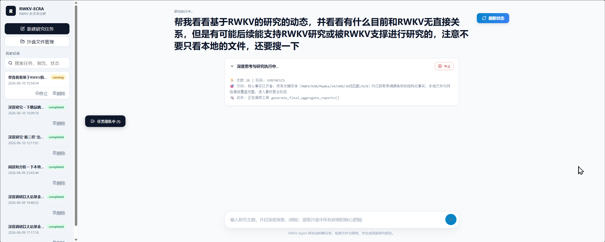
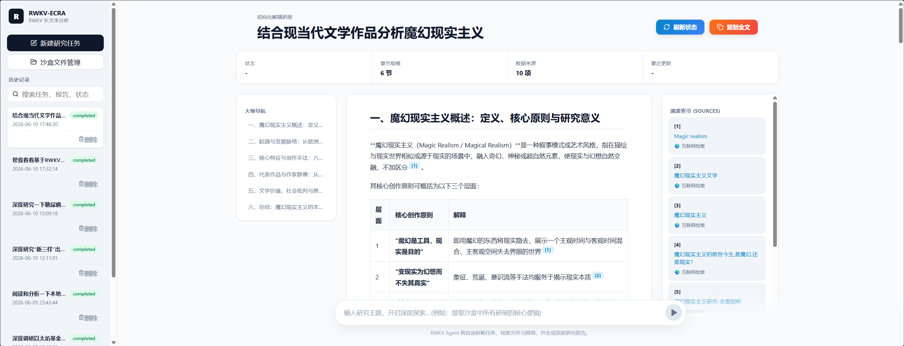

# RWKV-ECRA

Language: [中文](README.md) | English

## Features and Demonstrations

Currently, the primary function is long-text analysis, which can achieve results similar to DeepResearch. However, unlike common DeepResearch systems, it does not make decisions but solely presents the analysis.

After enabling the frontend, you can input research topics one by one to queue them up for processing;


The final report presents an analysis of the provided content with source citations. More examples can be found in the `data/output` directory. To avoid copyright issues, the `input` directory only contains open-access papers from arXiv.



## Usage

### 1. Environment Preparation

Python 3.10 or newer is recommended.

Install the basic dependencies required for the current code (using `uv pip` is recommended for faster automatic conflict resolution):

```bash
pip install fastapi uvicorn python-multipart openai requests tavily-python

```

> The project uses the latest version of the RWKV model by default, and prompts and parameters optimized for the 7.2B model have been configured. You don't need to change the parameters if you use a larger model. If using a smaller model, it is recommended to reduce the input length, while other parameters remain optimal.

> LLM calls based on StepFun, Volcengine and Baidu AI Studio are configured (default: stepfun / step-5-preview). The Baidu configuration comes with a built-in search engine and is set up with mandatory citations. `tavily` is configured for Volcengine. StepFun uses its standalone search API (`POST /step_plan/v1/search`, since step-5-preview does not support the built-in search tool). More comprehensive search engines will be added in the future.

### 2. rwkv_lightning Configuration Guide

This project requires calling the model started via [rwkv_lightning](https://github.com/RWKV-Vibe/rwkv_lightning). Support for the [Albatross](https://github.com/BlinkDL/Albatross) inference engine will be added later.

By default this project uses the engine's **fixed high-throughput endpoint** `/high_throughput/chat/completions` (must be enabled at launch; a resident concurrency pool of 128 is recommended):

```bash
cd models/rwkv_lightning
python app.py --model-path ../RWKV7-G1k-7.2B-20260930.pth \
  --port 8008 --password rwkv7_7.2b \
  --enable-high-throughput --high-throughput-max-active-states 128
```

For detailed configuration and usage tutorials, please refer to the [rwkv_lightning Batch Inference Tutorial](https://www.rwkv.cn/tutorials/intermediate/rwkv_lightning).

> On machines without a GPU (laptops, CI, etc.), you can use the built-in `slm_stepfun_adapter.py` to emulate this endpoint: it serves the exact same high-throughput batch protocol on local port 8008, forwarding requests to a StepFun small model (step-3.5-flash). Just configure `API_KEYS.stepfun` and run `python slm_stepfun_adapter.py`; the main program needs no changes. This is intended for functional verification only — use real on-device RWKV inference in production.

### 3. Parameter Configuration Guide

Below are the parameter descriptions found in `config.json`.

> Parameters that need to be configured before running

| Parameter Name | Function | Options |
| --- | --- | --- |
| `LLM_PROVIDER` | Model provider; StepFun, Volcengine and Baidu AI Studio are supported | `stepfun` `baidu` `volcengine` |
| `API_KEYS.baidu` | API_Key for Baidu AI Studio | `Any valid Key` (Optional if not used) |
| `API_KEYS.volcengine` | API_Key for Volcengine | `Any valid Key` (Optional if not used) |
| `API_KEYS.stepfun` | API_Key for StepFun | `Any valid Key` (Optional if not used) |
| `API_KEYS.tavily` | API_Key for tavily search engine | `Any valid Key` |

For other pre-configured modifiable parameters, please check the Appendix.

### 4. CLI Startup

```bash
cd RWKV-ECRA
python main.py
```

After starting, you can enter commands in the terminal, for example:

```
Help me look into the dynamics of RWKV-based research, and see if there is anything currently not directly related to RWKV, but might support RWKV research or be supported by RWKV in the future. Be sure not to only look at local files, but also perform a web search.

```

> Artifact check: run `python check_artifacts.py` to objectively inspect the reports under `data/output` (file integrity, citation-index closure, truncation detection, hallucinated citation residue, etc.) — useful for regression checks after changes.

### 5. GUI Startup

```bash
python api.py
```

Once started, the backend service runs at `http://0.0.0.0:8787` by default, and the frontend is already adapted to this port.

Then, open another terminal and enter `RWKV-ECRA/frontend`:

```bash
npm install
npm run dev
```

> Note: Node.js needs to be installed in advance. Please refer to the official Node.js website for installation instructions.

Once started, the frontend runs at `http://127.0.0.1:5177` by default.

## Future Optimization Plans

* Build in the [Albatross](https://github.com/BlinkDL/Albatross) inference engine, while retaining the current method of running on the service started by [rwkv_lightning](https://github.com/RWKV-Vibe/rwkv_lightning).
* Optimize performance and execution paths.
* Beautify the frontend and refine logging. Currently, the frontend lacks visual appeal and the logic could be more elegant.
* Support LLMs and search engines from more sources.
* Fix some existing citation parsing and passing issues in the near future.

## Appendix

### 1. Other Modifiable Parameters

> Parts with default parameters set that can be customized

| Parameter Name | Function | Options |
| --- | --- | --- |
| `LLM_ENDPOINTS.volcengine.base_url` | Volcengine model API base URL | `https://ark.cn-beijing.volces.com/api/v3` |
| `LLM_ENDPOINTS.volcengine.model` | Volcengine model name, check Volcengine documentation for details | `doubao-seed-2-0-lite-260428` |
| `LLM_ENDPOINTS.volcengine.reasoning_effort` | Volcengine model reasoning effort level | `medium` |
| `LLM_ENDPOINTS.baidu.base_url` | Baidu AI Studio model API base URL | `"https://aistudio.baidu.com/llm/lmapi/v3"` |
| `LLM_ENDPOINTS.baidu.model` | Baidu AI Studio model name | `ernie-5.1` |
| `LLM_ENDPOINTS.baidu.max_completion_tokens` | Baidu maximum output token limit | Must be less than `65536` |
| `LLM_ENDPOINTS.baidu.enable_web_search` | Whether to enable the built-in web search for the Ernie model | `true` |
| `LLM_ENDPOINTS.stepfun.base_url` | StepFun model API base URL | `https://api.stepfun.com/step_plan/v1` |
| `LLM_ENDPOINTS.stepfun.model` | StepFun model name (web search for step-5-preview goes through the standalone `POST /step_plan/v1/search`) | `step-5-preview` |
| `LLM_ENDPOINTS.stepfun.max_completion_tokens` | StepFun maximum output token limit | `65536` |
| `SEARCH_CONFIG.search_depth` | Tavily search depth parameter | `advanced` |
| `SEARCH_CONFIG.max_results` | Tavily maximum returned web pages | `10` |
| `SEARCH_CONFIG.time_range` | Tavily search time range | `year` `month` `week` `day` `none` |
| `SEARCH_CONFIG.chunks_per_source` | Number of chunks per search source | `5` |
| `DATA_PIPELINE.input_directory` | Workspace input path | `./data/input` |
| `DATA_PIPELINE.output_directory` | Workspace output path | `./data/output` |
| `DATA_PIPELINE.checkpoint_directory` | Checkpoint storage path | `"./data/checkpoints"` |
| `DATA_PIPELINE.debug_directory` | RWKV model debug log output path | `./data/debug_slm` |
| `DATA_PIPELINE.enable_debug_slm` | Whether to enable RWKV model debug log output | `false` `true` |
| `DATA_PIPELINE.allowed_extensions` | Allowed input file extensions. PDF and other formats are not currently supported; consider converting them first. | `[".txt", ".md"]` |
| `DATA_PIPELINE.max_chunk_tokens` | RWKV model max input tokens | Any integer (1600~2400 is recommended) |
| `DATA_PIPELINE.overlap_ratio` | Context overlap ratio during RWKV processing | Any float (0.05 is recommended) |
| `DATA_PIPELINE.reduce_group_size` | Batch size during RWKV's secondary summary merge | Any integer (less than 4 is recommended) |
| `DATA_PIPELINE.reduce_target_chunks` | Target number of chunks during reduce | `1` |
| `DATA_PIPELINE.reduce_max_tokens` | Max input tokens for the LLM summarization after RWKV reaches its compression limit | Any integer, min(32k, model max context/2) is recommended |
| `DATA_PIPELINE.slm_reduce_steps` | Maximum compression steps for RWKV | Any integer, 2 is recommended |
| `DATA_PIPELINE.llm_safe_window_tokens` | Maximum input safe window for the LLM | `60000` |
| `DATA_PIPELINE.map_focus` | Instruction for chunked summarization | `"保持原意压缩，提取核心逻辑，严格保留所有事实性内容"` |
| `DATA_PIPELINE.reduce_rule` | Instruction for merged summarization | `"保持原意压缩，去重并合并同类逻辑，绝对保留事实性数据和原始结论"` |
| `DATA_PIPELINE.map_focus_en` | English instruction for chunked summarization | `"Compress while maintaining original meaning, extract core logic, strictly preserve all factual content"` |
| `DATA_PIPELINE.reduce_rule_en` | English instruction for merged summarization | `"Compress while maintaining original meaning, deduplicate and merge similar logic, absolutely preserve factual data and original conclusions"` |
| `DATA_PIPELINE.english_ratio_threshold` | Text is judged as an English document if the English ratio exceeds this threshold, otherwise Chinese | `0.5` |
| `DATA_PIPELINE.reduce_max_tokens_internal` | Maximum input limit during the internal merge phase | `3500` |
| `DATA_PIPELINE.slm_repeat_threshold` | SLM repetition penalty threshold | `5` |
| `AGENT_CONFIG.max_files_per_batch` | Maximum files processed per round | `10` |
| `AGENT_CONFIG.max_error_retries` | Maximum error retries | `3` |
| `AGENT_CONFIG.memory_truncate_length` | Memory truncation length | `60000` |
| `SLM_CONFIG.endpoint` | RWKV API endpoint (uses the fixed high-throughput endpoint by default) | `"http://127.0.0.1:8008/high_throughput/chat/completions"` |
| `SLM_CONFIG.password` | RWKV API password (leave empty if none) | `"rwkv7_7.2b"` |
| `SLM_CONFIG.concurrency` | RWKV maximum concurrency | Integer. For the 7.2B model with 24GB VRAM, set to 128 (together with `--high-throughput-max-active-states 128`) |
| `REPORT_CONFIG.report_writer` | Report writing engine: LLM direct writing / SLM rolling-trace section writing | `"llm"` (default) `"slm"` |
| `REPORT_CONFIG.enable_section_source_binding` | Whether to enable SLM parallel rolling source-binding when the LLM writes the report (injects bound materials per section, costs more tokens) | `false` (default) `true` |
| `REPORT_CONFIG.enable_rolling_context` | LLM writes sections sequentially with digests of completed sections injected (more coherent and fuller, but slower) | `false` (default) `true` |
| `REPORT_CONFIG.rolling_context_budget_tokens` | Total token budget for rolling digests (oldest digests are compressed to titles first when exceeded) | `4000` |
| `REPORT_CONFIG.slm_section_ref_budget_tokens` | Per-section reference token budget for SLM writing (exceeding it triggers stepped generation then merge) | `8000` |
| `REPORT_CONFIG.slm_max_context_tokens` | Total context limit per SLM writing call | `16000` |
| `REPORT_CONFIG.slm_section_max_retries` | Retry limit per section/fragment on repetition (marks the section as failed beyond this) | `3` |
| `REPORT_CONFIG.slm_report_output_tokens` | Maximum output tokens per SLM writing call | `4000` |
| `TRACKING.enable` | Whether to enable log tracking | `true` |
| `TRACKING.enable_slm_log` | Whether to track RWKV processing logs | `false` |
| `TRACKING.log_dir` | Directory path to store logs | `"./logs"` |

```
